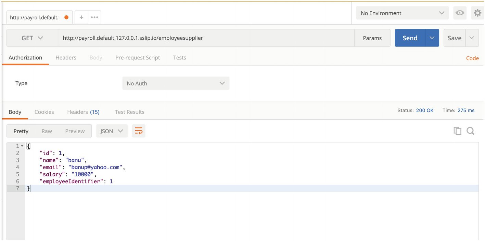

# Getting Started with Spring Cloud Function

##  Setting Up the Spring Boot and Spring Cloud Function Locally
## Test the Function
You can use curl or Postman to test your function. Here I use Postman. You can download Postman at https://www.postman.com/downloads/.

* In Postman, choose POST, the http://localhost:8080/employeeConsumer URL, and the JSON format input.
```json
{
   "name": "banu",
   "employeeIdentifier":"1",
   "email": "banu@yahoo.com",
   "salary":"1000"
}
```
* Using curl.
```bash
curl --location 'http://localhost:8080/employeeConsumer' \
--header 'Content-Type: application/json' \
--data-raw '{
   "name": "banu",
   "employeeIdentifier":"1",
   "email": "banu@yahoo.com",
   "salary":"1000"
}'
```
* Using H2 console: `http://localhost:8080/h2-console/`
  * jdbc url: `jdbc:h2:mem:employee`

# Setting Up Locally with Kubernetes and Knative and Spring Cloud Function
This section explores another way to deploy Spring Cloud Function. Kubernetes, as you might be aware, is a portable approach to containerization and running containers. Kubernetes allows you to host containers that are packaged as images and deployed on Kubernetes pods.

Knative is an environment that sits on Kubernetes and can host a function. Chapter 1 explained how the cloud providers created environments such as AWS Lambda that could start up on demand and shut down when a resource is not in use. Similarly, you can create such an on-demand environment with Knative for functions. This section explores how to set up the Knative environment locally, which is difficult with AWS and Google Functions, and deploy and work with your functions locally and on the cloud. This section starts with local deployment and then moves on to the cloud.

You will notice that I used EmployeeSupplier as the function. To do this, you need to prepopulate the H2 database with some data so that you can query the database using the EmployeeSupplier function.

Prerequisites:
* Docker on Mac, Linux, or Windows
* Kind (Kubernetes in Docker)
* Knative serving
* IntelliJ, Eclipse, VS Code, or other IDEs
* Code from GitHub

Here is the process of setting up Kubernetes and Knative and deploying Spring Cloud Function.

## Step 1: Set up a Kubernetes cluster locally. 
In this step, you install a local Kubernetes cluster. You deploy a KIND (Kubernetes IN Docker). Cluster. Of course, you can use Minikube or Minishift to deploy locally.

1. First, you need Docker.
`https://ide.cloud.google.com?boost=true`
2.	Install Kubectl.
This step is required, as you need Kubectl to interact with the Kubernetes cluster
3.	Install KIND.

## Step 2: Configure Knative.
In order to configure Knative, you need a KIND cluster. You will create a cluster with custom configuration.
https://knative.dev/blog/articles/set-up-a-local-knative-environment-with-kind/

Create a cluster using a configuration file called `clusterconfig.yaml`. Note that the name of the cluster is "knative”. You can name it differently, but you have to use that cluster to deploy Knative; see Listing 2-14.
```bash
$ cat > clusterconfig.yaml <<EOF
kind: Cluster
apiVersion: kind.sigs.k8s.io/v1alpha4
nodes:
- role: control-plane
  extraPortMappings:
    ## expose port 31080 of the node to port 80 on the host
  - containerPort: 31080
    hostPort: 80
    ## expose port 31443 of the node to port 443 on the host
  - containerPort: 31443
    hostPort: 443
EOF

$ kind create cluster --name knative --config clusterconfig.yaml
```
> Listing 2-14Create clusterconfig.yaml and Run the Create Cluster
To set up Knative, you need to install and configure the following:
> * Knative serving (information about Knative serving is available at https://knative.dev/docs/serving)
> * Kourier is a lightweight Knative serving ingress and is available at https://github.com/knative-sandbox/net-kourier.
> * Magic DNS is a DNS provider and is available at https://knative.dev/docs/install/yaml-install/serving/install-serving-with-yaml/#configure-dns.

Install Knative serving
1. Install the Knative serving components (i.e., crds and core):
```bash
$ kubectl apply -f https://github.com/knative/serving/releases/download/knative-v1.6.0/serving-crds.yaml
$ kubectl apply -f https://github.com/knative/serving/releases/download/knative-v1.6.0/serving-core.yaml
```
2.	Set up networking using Kourier:
```bash 
$ curl -Lo kourier.yaml https://github.com/knative/net-kourier/releases/download/knative-v1.6.0/kourier.yaml
```
3. Change the file to use nodePort, as shown in Listing 2-15.
   By default, the Kourier service is set to be of type `LoadBalancer`. On local machines, this type doesn’t work, so you’ll have to change the type to `NodePort` and add `nodePort` elements to the two listed ports.

  The complete Service portion (which runs from line 75 to line 94 in the document), should be replaced with:
   ```yaml
   apiVersion: v1
   kind: Service
   metadata:
   name: kourier
   namespace: kourier-system
   labels:
      networking.knative.dev/ingress-provider: kourier
   spec:
   ports:
   - name: http2
      port: 80
      protocol: TCP
      targetPort: 8080
      nodePort: 31080
   - name: https
      port: 443
      protocol: TCP
      targetPort: 8443
      nodePort: 31443
   selector:
      app: 3scale-kourier-gateway
   type: NodePort
   ```
   >  Listing 2-15 Configure nodePort
4.	Install Kourier.
   Install Kourier by running the following command (see Figure 2-23):
   ```bash   
   $ kubectl apply --filename kourier.yaml

   namespace/kourier-system created
   configmap/config-logging created
   configmap/config-observability created
   configmap/config-leader-election created
   service/kourier created
   deployment.apps/3scale-kourier-gateway created
   deployment.apps/3scale-kourier-control created
   clusterrole.rbac.authorization.k8s.io/3scale-kourier created
   serviceaccount/3scale-kourier created
   clusterrolebinding.rbac.authorization.k8s.io/3scale-kourier created
   service/kourier-internal created
   service/kourier-control created
   configmap/kourier-bootstrap created
   ```
5.	Set Kourier as the default networking layer by installing the following patch:
   ```bash 
   $ kubectl patch configmap/config-network \
     --namespace knative-serving \
     --type merge \
     --patch '{"data":{"ingress-class":"kourier.ingress.networking.knative.dev"}}'
   ```  
6.	Set up a wildcard DNS with sslip.io:
```bash 
$ kubectl apply -f https://github.com/knative/serving/releases/download/knative-v1.6.0/serving-default-domain.yaml
```
7.	Patch with sslip.io:
   ```bash 
   $ kubectl patch configmap/config-domain \
   --namespace knative-serving \
   --type merge \
   --patch '{"data":{"127.0.0.1.sslip.io":""}}'
   ```
8.	Get the status of the pods in the Knative serving:
   ```bash 
   $ kubectl get pods -n knative-serving
   ```
   You can see in Figure 2-24 that all the components are up and running. You can go to the next step of publishing your Spring Cloud Function app on Knative.
   ```bash
   $ kubectl get pods -n knative-serving
   NAME                                      READY   STATUS    RESTARTS   AGE
   activator-88b7df5c-htz6s                  1/1     Running   0          2m52s
   autoscaler-7bf8ff94db-hnd56               1/1     Running   0          2m52s
   controller-7fd644cbc6-gzpbf               1/1     Running   0          2m52s
   default-domain-hmmpf                      1/1     Running   0          23s
   domain-mapping-5bcd85fbc6-wjr74           1/1     Running   0          2m52s
   domainmapping-webhook-77f466bbc9-jx6jr    1/1     Running   0          2m52s
   net-kourier-controller-66f55d8b45-9hgds   1/1     Running   0          97s
   webhook-69d55f5549-2mmqx                  1/1     Running   0          2m52s
   ```
## Step 3: Containerize the app and push it to a repository. 
   Create a Dockerfile with the parameters set shown in Listing 2-16.

## Step 4: Deploy the app to Knative. 
1. You need to create a YAML file for the service. Notice the image that has been used. I pushed a Docker image called `“main”` that exposes `employeeSupplier`. You will see that I will use a different image when pushing to other cloud providers. This is to get you acquainted with pushing different images with different exposed endpoints. See Listing 2-17.
```yaml
apiVersion: serving.knative.dev/v1 # Current version of Knative
kind: Service
metadata:
  name: payroll # The name of the app
  namespace: default # The namespace the app will use
spec:
  template:
    spec:
      containers:
        - image: docker.io/banupkubeforce/springcloudfunctions:main # The URL to the image of the app
          env:
            - name: TARGET # The environment variable printed out by the sample app
              value: "employeesupplier"
```
> Listing 2-17 payroll.yaml

2. The next step is to deploy the app to Knative. 
   Run the following command to install the application with Knative serving:
   ```bash
   $ kubectl apply -f payroll.yaml
   ```
   Alternatively, you can use a [Knative CLI](https://github.com/knative/client/blob/main/docs/README.md). More information can be found at https://knative.dev/docs/client/#kubectl.
   ```bash
   $ kn service create payroll –image docker.io/banupkubeforce/springcloudfunctions:main
   ```
   > https://knative.dev/docs/getting-started/quickstart-install/#run-the-knative-quickstart-plugin
   > https://github.com/knative-sandbox/kn-plugin-quickstart
   > https://github.com/knative-sandbox/kn-plugin-quickstart/releases
   > https://knative.dev/docs/install/serving/install-serving-with-yaml/#configure-dns
   
A YAML execution gives you more control over the target environment. Note this URL, as it is required for the testing step. The URL shown here for example is `https://payroll.default.127.0.0.1.sslip.io` .

You can run the following command to get the URL and check if the endpoint is ready for testing.   

## Step 5: Test 
Since `employeeSupplier` queries the database and gets the records, you need to use a `GET` operation. See Figure 2-26.  
 
> Figure 2-26 Test with Postman

```bash
$  ./kn service list
NAME      URL                                            LATEST          AGE   CONDITIONS   READY   REASON
payroll   http://payroll.default.192.168.49.2.sslip.io   payroll-00001   35s   3 OK / 3     True    

$ curl   http://payroll.default.192.168.49.2.sslip.io/employeesupplier |jq "."
  % Total    % Received % Xferd  Average Speed   Time    Time     Time  Current
                                 Dload  Upload   Total   Spent    Left  Speed
100    88    0    88    0     0    342      0 --:--:-- --:--:-- --:--:--   343
{
  "id": 1,
  "name": "banu",
  "email": "banup@yahoo.com",
  "salary": "10000",
  "employeeIdentifier": 1
}
```

In this section, you created a KIND-based Kubernetes cluster, configured Knative, and deployed the application. You created a portable image that can be deployed to any Kubernetes cluster that has been configured with Knative.